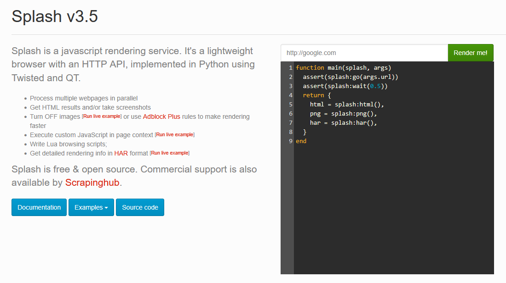

# trends-scraper

The Trends Scraper is a google trends scraping service, utilising both Scrapy and Splash to scrape the JavaScript rendering keywords of the Google Trends /trending endpoint.

The aim of this programme is to be hosted on your local machine, withe potetnial to host the server at sompoint in the future as a means of connecting to my other app in progress, Trendy Talks.

As it stands, it takes a dummy link for the United Kingdom under the sports category, as it has a lot of keywords to see and mess around with.

The core function of the programme will write two files. The first is a general HTML scraper, which waits five seconds for the JS to effectively render the trends. You cna lower this if you wish in the trends_spider.py file. Then when it has that file, it runs a callback function on itself to then begin looping through the HTML looking for the divs we have isolated that contain text within the table. At the moment I am only interested in the keyword and trending range for my own uses, bnut you can simply Ctrl-f ```mZ3RIc``` in the HTML parsed file and see what the other divs are called and what to look for, followed by ```::text``` as that tells the spider to pick out those elements. 


I've also added a test file that simulates fake keywords to the test for unit testing. Simply run python test.py in the CLI to get it running.

## Getting Started

To run the scraper, you will need the following

```Python
- pip install scrapy
- pip install scrapy-splash
```

You will also need to install Docker, as Docker is required to run the JavaScript built into Splash and run this command in your terminal:
- ``` docker run -p 8050:8050 scrapinghub/splash```

> [!NOTE]  
> Docker is necessary to run the programme. You will likely need to restart your machine once Docker has downloaded. You can find the link to the relevant Docker via the Splash docs https://splash.readthedocs.io/en/latest/install.html.

From there, adjust the setting.py file as required for where the Docker is running the splash bot on your hosted localhost or IP and its port.

You can test the Docker is working by following the Docker link and seeing an image like this.


Once the Docker is hosted, you can run the following command:
- scrapy crawl trends

This CLI command will run the script to crawl the link to the trends link. And acquire data. In the future, this will by a dynamic link, being pinged from a front end application. But for now. It is a static link for testing purposes.

### Updates to come

Current ideas to add to the file:
1. Complete dynamic link for the spider script.
2. Find a way to make the rendering speed dynamic. Likely a recursive statement that checks if the keyword div class name is present to speed up keyword rendering speeds for front end usage.
3. Likely add an automate scraping session to fill the other backend Socket rooms I intend to make so there's some automation for users as they visit the site.

> [!WARNING]
> Google is very good at randomly changing the way the /trending page works in Google Trends. So there is a solid chance at some point in the future this spider will break.